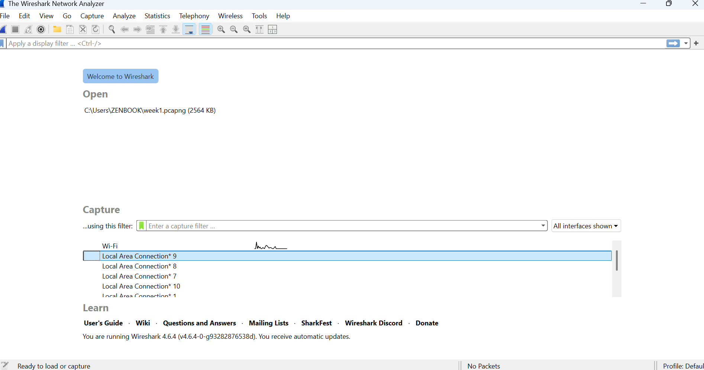

# Laporan Praktikum Jarkom IF

## Tujuan praktikum
Tujuan dari praktikum ini adalah memahami mekanisme komunikasi data melalui protokol HTTP. Dengan bantuan aplikasi Wireshark, kita akan melakukan capture dan analisis terhadap paket-paket data yang dikirimkan dari sisi client menuju server maupun sebaliknya.

Website yang dipakai: http://gaia.cs.umass.edu/wireshark-labs/INTRO-wireshark-file1.html

## Langkah Kerja
1. Mengecek Konfigurasi IP melalui Terminal
    -IPv4 Address (10.218.14.65): Alamat IP laptop/komputer yang berperan sebagai client.
    -Default Gateway (10.218.0.253): Alamat router yang menghubungkan jaringan lokal ke jaringan lain atau internet.
2. Menjalankan Wireshark dan Memilih Interface Wi-Fi
    Membuka aplikasi Wireshark lalu memilih interface Wi-Fi sebagai sumber penangkapan paket karena koneksi internet menggunakan jaringan nirkabel.
3. Menerapkan Filter HTTP
    Mengetik “http” pada kolom filter di Wireshark untuk menampilkan hanya paket data HTTP agar analisis lebih mudah.
4. Mengakses Website Uji Coba
    Saat website dibuka, browser mengirim HTTP Request ke server, kemudian server mengirim kembali HTTP Response ke client.

## Lampiran
Hasil Percobaan:
