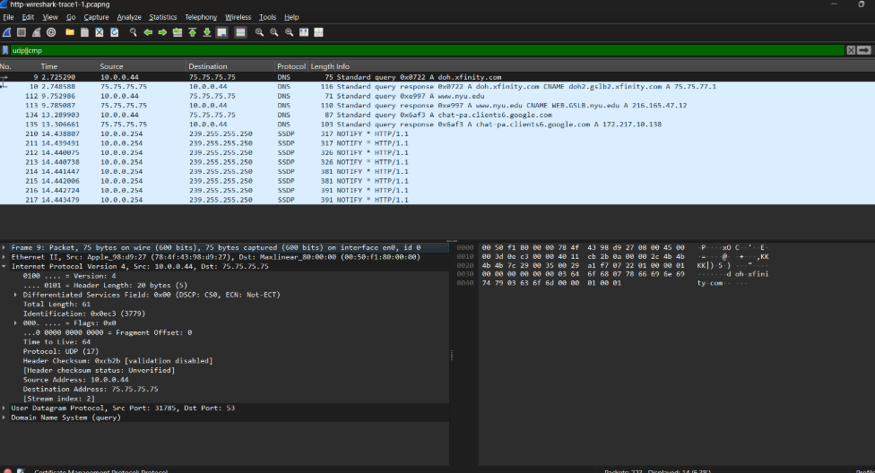
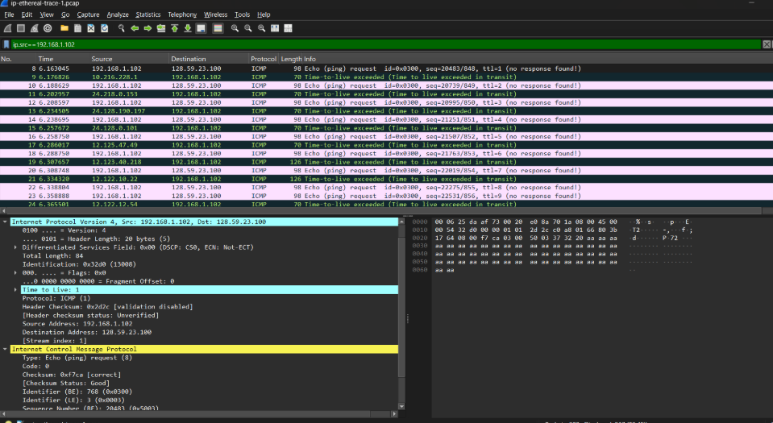
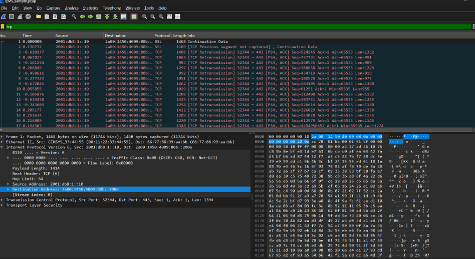

# Laporan Praktikum Jaringan Komputer - Modul 10

## Internet Protocol (IP)

---


### **Identitas Praktikan**
| Detail Mahasiswa | Informasi |
| :--- | :--- |
| **Nama** | [Fadia Nabila Shifa] |
| **NIM** | [103072400066] |
| **Kelas** | [IF-04-02] |


---

## 10.1 Tujuan Praktikum

1. Memahami konsep dasar Internet Protocol versi 4 (IPv4).
2. Mengidentifikasi alamat IP yang digunakan oleh perangkat dalam jaringan.
3. Melakukan pengujian konektivitas jaringan menggunakan protokol ICMP.
4. Mengenal konsep dasar Internet Protocol versi 6 (IPv6).
5. Menganalisis perbedaan antara IPv4 dan IPv6.

---

## 10.2 Dasar IPv4

### 10.2.1 Penjelasan

IPv4 (Internet Protocol Version 4) merupakan protokol yang digunakan untuk memberikan alamat unik pada setiap perangkat yang terhubung ke jaringan. IPv4 menggunakan panjang alamat 32-bit yang ditulis dalam empat kelompok angka desimal yang dipisahkan oleh tanda titik.

Contoh alamat IPv4:

```text
192.168.1.1
```

---

### 10.2.2 Hasil Praktikum IPv4

#### Langkah Pengujian

Melakukan pengecekan konfigurasi jaringan untuk melihat alamat IPv4 yang digunakan oleh perangkat.

```bash
ipconfig
```



> Menunjukkan informasi konfigurasi jaringan yang meliputi alamat IPv4, subnet mask, dan default gateway.

---

## 10.3 ICMP (Ping Test)

### 10.3.1 Penjelasan

ICMP (Internet Control Message Protocol) merupakan protokol yang digunakan untuk mengirimkan pesan kontrol dan diagnostik pada jaringan komputer. Salah satu penggunaannya adalah melalui perintah `ping` untuk menguji konektivitas antara dua perangkat.

---

### 10.3.2 Hasil Praktikum ICMP

#### Langkah Pengujian

```bash
ping google.com
```



> Menunjukkan hasil pengujian koneksi jaringan menggunakan perintah ping ke server Google yang menampilkan waktu respons dan status pengiriman paket.

### Hasil Pengamatan

- Paket data berhasil dikirim ke server tujuan.
- Balasan diterima dari server tanpa kehilangan paket.
- Nilai waktu respons (latency) dapat diamati dari hasil pengujian.
- Koneksi internet berjalan dengan baik.

---

## 10.4 IPv6

### 10.4.1 Penjelasan

IPv6 merupakan pengembangan dari IPv4 yang dirancang untuk mengatasi keterbatasan jumlah alamat IP. IPv6 menggunakan alamat sepanjang 128-bit sehingga mampu menyediakan jumlah alamat yang jauh lebih besar dibandingkan IPv4.

Contoh alamat IPv6:

```text
2001:0db8:85a3:0000:0000:8a2e:0370:7334
```

---

### 10.4.2 Hasil Praktikum IPv6

#### Langkah Pengujian

```bash
ipconfig
```



> Menunjukkan alamat IPv6 yang dimiliki perangkat berdasarkan hasil konfigurasi jaringan.

---

## 10.5 Analisis Praktikum

### 10.5.1 Analisis IPv4

#### Hasil Pengamatan

- IPv4 menggunakan alamat sepanjang 32-bit.
- Setiap perangkat memiliki alamat IP yang berbeda.
- IPv4 masih menjadi standar yang paling banyak digunakan pada jaringan saat ini.

#### Kelebihan

- Mudah diimplementasikan.
- Didukung oleh hampir seluruh perangkat jaringan.
- Konfigurasi relatif sederhana.

#### Kekurangan

- Jumlah alamat yang tersedia terbatas.
- Membutuhkan teknik tambahan seperti NAT untuk menghemat penggunaan alamat IP.

---

### 10.5.2 Analisis ICMP

#### Hasil Pengamatan

- ICMP dapat digunakan untuk menguji apakah suatu host dapat dijangkau.
- Hasil ping menunjukkan kualitas koneksi jaringan.
- Waktu respons dapat digunakan untuk mengetahui performa jaringan.

#### Manfaat

- Membantu proses troubleshooting jaringan.
- Memudahkan pengecekan konektivitas internet.
- Dapat digunakan untuk mendeteksi gangguan komunikasi data.

---

### 10.5.3 Analisis IPv6

#### Hasil Pengamatan

- IPv6 menggunakan panjang alamat 128-bit.
- Jumlah alamat yang tersedia jauh lebih besar dibandingkan IPv4.
- IPv6 dirancang untuk memenuhi kebutuhan jaringan di masa depan.

#### Keunggulan

- Menyediakan ruang alamat yang sangat luas.
- Mendukung efisiensi routing yang lebih baik.
- Memiliki fitur keamanan yang lebih baik dibandingkan IPv4.

---

## 10.6 Perbandingan IPv4 dan IPv6

| Aspek | IPv4 | IPv6 |
|--------|--------|--------|
| Panjang Alamat | 32-bit | 128-bit |
| Format Penulisan | Desimal Bertitik | Heksadesimal |
| Jumlah Alamat | Terbatas | Sangat Banyak |
| Contoh Alamat | 192.168.1.1 | 2001:db8::1 |
| Ketersediaan Alamat | Terbatas | Hampir Tidak Terbatas |

---

## 10.7 Kesimpulan

1. IPv4 merupakan protokol pengalamatan yang masih banyak digunakan dalam jaringan komputer saat ini.
2. Pengujian menggunakan ICMP berhasil menunjukkan bahwa koneksi jaringan berjalan dengan baik.
3. IPv6 hadir sebagai solusi atas keterbatasan jumlah alamat yang dimiliki IPv4.
4. IPv6 menyediakan kapasitas alamat yang jauh lebih besar dibandingkan IPv4.
5. Praktikum ini membantu memahami konsep dasar IP serta mekanisme komunikasi pada jaringan komputer.

---