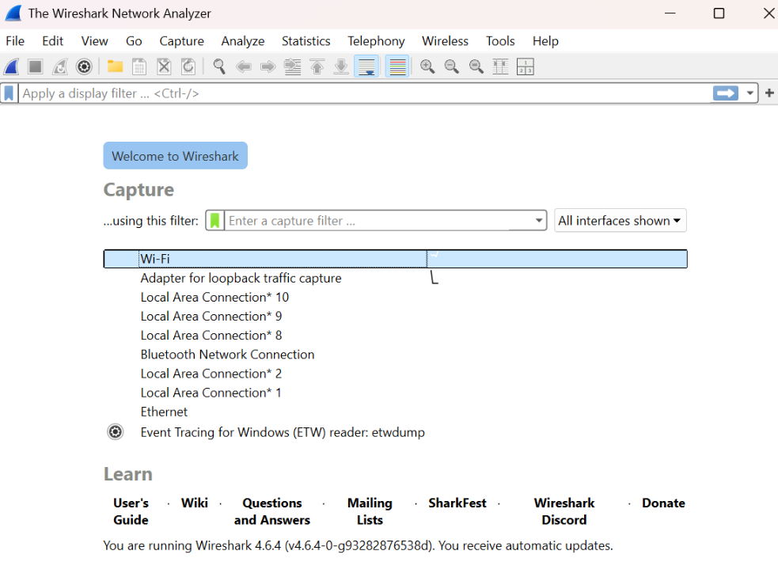

# Laporan Praktikum Jaringan Komputer - Modul 2
## Analisis Protokol Jaringan Menggunakan Wireshark

---

### **Identitas Praktikan**
| Detail Mahasiswa | Informasi |
| :--- | :--- |
| **Nama** | [Fadia Nabila Shifa] |
| **NIM** | [103072400066] |
| **Kelas** | [IF-04-02] |

---

### **1. Tujuan Praktikum**
Berdasarkan panduan praktikum Jaringan Komputer, sasaran utama dari pelaksanaan Modul 2 ini adalah:
1. Mahasiswa mampu melakukan persiapan serta instalasi perangkat lunak **Wireshark** secara mandiri.
2. Mahasiswa mampu mengoperasikan fitur-fitur utama Wireshark untuk melakukan penyadapan (*capturing*) dan identifikasi paket data pada jaringan aktif.

---

### **2. Landasan Teori**

#### **2.1 Mekanisme Kerja Packet Sniffer**
Wireshark dioperasikan sebagai *Packet Sniffer*, yakni sebuah instrumen yang berfungsi untuk mengamati pertukaran data antar entitas protokol secara pasif. Alat ini bekerja dengan menyalin setiap pesan yang melintasi antarmuka jaringan tanpa melakukan modifikasi atau intervensi terhadap arus data aslinya.

Fungsionalitas *Packet Sniffer* ditopang oleh dua pilar utama:
* **Capture Library:** Bertugas mengamankan salinan dari setiap *frame* pada lapisan fisik yang dideteksi oleh perangkat.
* **Packet Analyzer:** Bertugas menguraikan seluruh *field* dalam pesan protokol berdasarkan standar yang berlaku (seperti Ethernet, IP, TCP, dan HTTP).

#### **2.2 Organisasi Antarmuka Wireshark**
Lingkungan kerja Wireshark didukung oleh lima komponen fungsional utama:
1. **Command Menu:** Kumpulan navigasi untuk mengelola seluruh operasional aplikasi.
2. **Packet Listing:** Daftar ringkas seluruh paket yang berhasil diakuisisi secara kronologis.
3. **Packet Header Details:** Penjelasan mendalam mengenai lapisan protokol paket yang dipilih secara hierarkis.
4. **Packet Contents:** Tampilan konten mentah dari sebuah *frame* dalam format ASCII dan heksadesimal.
5. **Display Filter Field:** Kolom khusus untuk menyaring paket data guna meningkatkan efisiensi analisis.

---

### **3. Prosedur Pelaksanaan**

Berikut adalah urutan prosedur sistematis yang dilaksanakan selama praktikum:

1. **Tahap Inisialisasi:** Memastikan koneksi internet aktif, lalu menjalankan aplikasi peramban serta perangkat lunak Wireshark.
2. **Aktivasi Capturing:** Memilih *interface* jaringan yang aktif (misal: Wi-Fi) melalui menu `Capture` > `Interfaces`, kemudian menekan instruksi **Start**.
3. **Pemicuan Traffic:** Mengakses laman web pengujian `http://gaia.cs.umass.edu/wireshark-labs/INTRO-wireshark-file1.html` dan menunggu hingga konten termuat sepenuhnya.
4. **Terminasi dan Filtrasi:** Menghentikan proses perekaman (tombol kotak merah), lalu menggunakan filter `http` untuk mengisolasi paket yang relevan.
5. **Analisis Struktur:** Membedah paket `HTTP GET` melalui panel *Header Details* untuk menelaah enkapsulasi pada tiap lapisan protokol.

---

### **4. Analisis Hasil Pengamatan**

#### **4.1 Konfigurasi Awal Antarmuka**
Pada tahap awal, sistem menampilkan seluruh kartu jaringan yang tersedia. Pemilihan dilakukan pada *interface* dengan fluktuasi trafik paling tinggi untuk menjamin data berhasil ditangkap.

#### **4.2 Observasi Log Paket**
Setelah simulasi akses web dilakukan, panel *Packet List* menampilkan akumulasi seluruh paket. Terlihat adanya beragam protokol sistem yang berjalan secara simultan di latar belakang meskipun hanya membuka satu halaman web.

*Gambar 2: Rekaman trafik data mentah secara keseluruhan.*

#### **4.3 Implementasi Filter dan Bedah Protokol**
Penggunaan filter `http` berhasil mengisolasi lalu lintas data sehingga pengamatan fokus pada paket `HTTP GET`.

*Gambar 3: Dekomposisi lapisan protokol pada paket HTTP GET.*

**Penjelasan Hierarki Paket:**
* **Frame:** Informasi fisik mengenai paket yang diakuisisi.
* **Ethernet II:** Detail alamat fisik (MAC Address) sumber dan tujuan.
* **Internet Protocol Version 4:** Informasi alamat logika (IP Address) pengirim dan penerima.
* **Transmission Control Protocol:** Mengelola informasi *port* serta sinkronisasi nomor urut paket.
* **Hypertext Transfer Protocol:** Memuat metode *request* (GET), identitas *host*, dan informasi *user-agent*.

#### **4.4 Tinjauan Data Mentah**
Area terbawah menyajikan representasi data asli dalam format heksadesimal dan ASCII.

*Gambar 4: Tampilan konten paket dalam format Hex dan ASCII.*

---

---

### **5. Kesimpulan**
Berdasarkan hasil observasi dan analisis yang telah dilakukan, dapat disimpulkan beberapa poin utama sebagai berikut:
1. **Efektivitas Tools:** Wireshark terbukti sebagai instrumen *packet sniffer* yang andal dalam memetakan dinamika komunikasi data pada jaringan secara *real-time*.
2. **Krusialitas Fitur Filter:** Penggunaan *display filter* sangat krusial untuk menyaring redundansi paket, sehingga proses identifikasi protokol spesifik (seperti HTTP) menjadi lebih efisien.
3. **Interdependensi Protokol:** Terlihat adanya keterkaitan antar-layer, di mana operasional lapisan aplikasi (HTTP) sepenuhnya ditopang oleh protokol lapisan bawah seperti TCP, IP, dan Ethernet.
4. **Kompetensi Analisis:** Praktikum ini berhasil memperkuat pemahaman mengenai struktur enkapsulasi data serta navigasi antarmuka Wireshark sebagai landasan analisis jaringan tingkat lanjut.