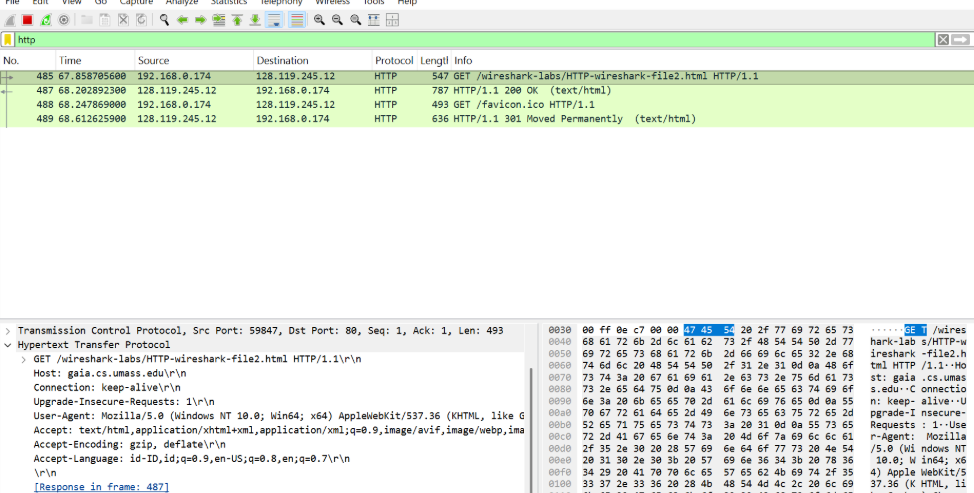
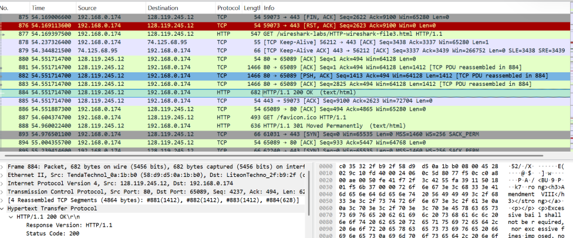

# Laporan Praktikum Jaringan Komputer - Modul 3
## INVESTIGASI PROTOKOL HTTP DENGAN WIRESHARK

---

### **Identitas Praktikan**
| Detail Mahasiswa | Informasi |
| :--- | :--- |
| **Nama** | [Fadia Nabila Shifa] |
| **NIM** | [103072400066] |
| **Kelas** | [IF-04-02] |

---

### **1. TUJUAN PRAKTIKUM**
* Menginvestigasi struktur pesan HTTP GET/Response secara mendalam menggunakan Wireshark.
* Memahami mekanisme *Conditional GET* dan pengelolaan *browser cache* untuk efisiensi bandwidth.
* Menganalisis bagaimana protokol TCP melakukan segmentasi dan *reassembly* pada dokumen berukuran besar.

---

### **2. DASAR TEORI**
**HTTP (Hypertext Transfer Protocol)** adalah protokol *request-response* yang beroperasi pada lapisan aplikasi. Protokol ini bersifat *stateless*, yang berarti setiap permintaan diproses secara mandiri tanpa menyimpan status koneksi sebelumnya.

Dalam operasionalnya, HTTP sangat bergantung pada **TCP (Transmission Control Protocol)** di lapisan transport untuk menjamin pengiriman data yang andal. Beberapa fitur utama yang dianalisis dalam modul ini adalah:
* **Conditional GET:** Mekanisme validasi konten menggunakan header `If-Modified-Since`. Jika konten di server belum berubah, server akan mengirim status `304 Not Modified`.
* **Segmentation:** Proses pemecahan data besar di lapisan transport karena keterbatasan *Maximum Segment Size* (MSS).
* **HTTP Authentication:** Skema keamanan sederhana di mana kredensial dikirimkan dalam format *Base64 encoding*.

---

### **3. LANGKAH KERJA**
1. **Persiapan:** Membuka Wireshark, memilih interface jaringan yang aktif, dan menerapkan filter `http`.
2. **Pembersihan Cache:** Melakukan *Clear Browser Cache* untuk memastikan data diambil langsung dari server, bukan dari penyimpanan lokal.
3. **Eksperimen Basic:** Mengakses URL file HTML statis untuk menganalisis struktur header permintaan dan respon.
4. **Uji Caching:** Mengakses URL secara berulang (refresh) untuk memicu pengiriman header kondisional.
5. **Analisis Data Besar:** Mengunduh dokumen teks panjang (>4000 bytes) untuk mengamati segmentasi PDU pada layer transport.
6. **Observasi Objek:** Mengakses halaman dengan banyak gambar untuk melihat antrean request HTTP yang berbeda-beda.
7. **Audit Keamanan:** Mengakses halaman terproteksi dan mencari header `Authorization` pada paket yang tertangkap.

---

### **4. HASIL DAN PEMBAHASAN**

#### **4.1 Interaksi Dasar HTTP GET/Response**
Pada percobaan pertama, terekam paket HTTP GET yang dikirimkan oleh browser menuju server.

**Analisis Teknis:** Paket GET berisi informasi penting seperti Host, User-Agent, dan Accept-Language. Server merespons dengan status `200 OK` yang membawa payload berupa kode HTML. Komunikasi ini berjalan di atas port 80 dan semua data dikirim dalam bentuk teks terbuka (*plain-text*).

#### **4.2 Mekanisme HTTP Conditional GET**
Percobaan ini menunjukkan bagaimana browser mengoptimalkan pengambilan data dengan fitur *caching*.

**Analisis Teknis:** Pada akses kedua (setelah refresh), browser mengirimkan header `If-Modified-Since`. Karena server mendeteksi file belum berubah, server merespons dengan status `304 Not Modified`. Hal ini membuat browser mengambil data dari cache lokal saja, sehingga menghemat konsumsi bandwidth secara signifikan.

#### **4.3 Penanganan Dokumen Berukuran Besar**
Saat mengunduh dokumen teks yang panjang, Wireshark menunjukkan adanya fragmentasi paket di layer bawah.

**Analisis Teknis:** Terlihat beberapa paket TCP dengan label `[TCP segment of a reassembled PDU]`. Ini terjadi karena ukuran file melebihi kapasitas satu segmen TCP (MSS). Data dipecah di lapisan transport dan baru disusun kembali (*reassembled*) di lapisan aplikasi menjadi satu pesan HTTP utuh.

#### **4.4 HTML Documents dengan Embedded Objects**
Mengakses halaman web yang memiliki banyak aset ternyata menghasilkan trafik yang cukup padat.

#### **4.5 Keamanan HTTP Basic Authentication**
Analisis pada halaman terproteksi menunjukkan bagaimana data kredensial ditransmisikan antara client dan server.

**Analisis Teknis:** Setelah proses login, muncul header `Authorization: Basic` yang diikuti oleh string Base64. Karena ini hanya metode encoding dan bukan enkripsi, informasi username dan password sangat mudah dibaca menggunakan decoder jika trafik disadap oleh pihak ketiga.

---

### **5. KESIMPULAN**
Berdasarkan hasil praktikum Modul 3, dapat disimpulkan bahwa:
1. Protokol HTTP sangat bergantung pada layer transport (TCP) untuk menjamin integritas data besar melalui mekanisme segmentasi.
2. Fitur *Conditional GET* dan *caching* merupakan elemen krusial untuk efisiensi jaringan dalam menghindari pengiriman data redundan.
3. Transmisi data pada HTTP standar memiliki risiko keamanan yang tinggi karena formatnya yang *plain-text*, sehingga penggunaan HTTPS sangat diperlukan untuk melindungi data sensitif.