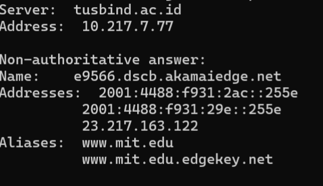
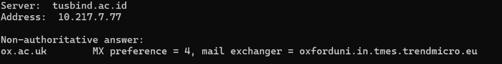
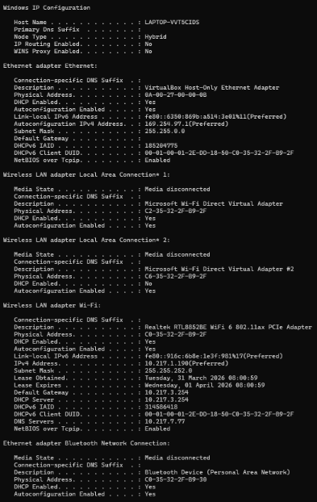
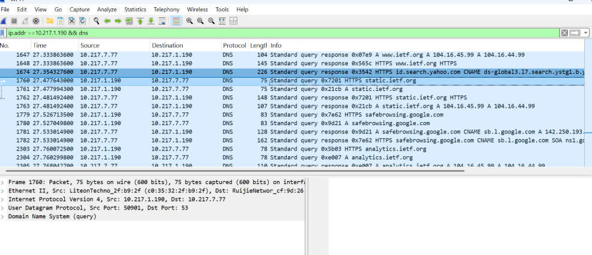

# Laporan Praktikum Jaringan Komputer - Modul 4
## DOMAIN NAME SYSTEM (DNS)

---

### **Identitas Praktikan**
| Detail Mahasiswa | Informasi |
| :--- | :--- |
| **Nama** | [Fadia Nabila Shifa] |
| **NIM** | [103072400066] |
| **Kelas** | [IF-04-02] |

---

### **1. TUJUAN PRAKTIKUM**
* Memahami mekanisme resolusi nama domain menjadi alamat IP melalui protokol DNS.
* Mengonfigurasi DNS Server secara mandiri menggunakan BIND9 pada sistem operasi Linux.
* Menganalisis paket query dan response DNS menggunakan alat bantu Wireshark.
* Mempelajari pembuatan zona Forward dan Reverse untuk pemetaan nama host.

---

### **2. DASAR TEORI**
**DNS (Domain Name System)** adalah sistem basis data terdistribusi yang berfungsi menerjemahkan nama domain yang mudah diingat manusia (seperti `google.com`) menjadi alamat IP yang dimengerti oleh mesin. DNS bekerja pada port 53 dan umumnya menggunakan protokol UDP untuk kecepatan transmisi.

Beberapa komponen utama dalam konfigurasi DNS adalah:
* **Forward Zone:** Memetakan nama domain ke alamat IP.
* **Reverse Zone:** Memetakan alamat IP kembali ke nama domain (digunakan untuk validasi).
* **Resource Records (RR):** Berisi tipe record seperti `A` (IPv4), `CNAME` (Alias), dan `NS` (Name Server).
* **Recursive vs Iterative Query:** Cara DNS server mencari informasi alamat IP melalui hierarki root, TLD, hingga authoritative server.

---

### **3. LANGKAH KERJA**
1. **Instalasi Paket:** Melakukan instalasi layanan DNS dengan perintah `sudo apt install bind9 bind9utils bind9-doc`.
2. **Konfigurasi Options:** Mengatur *forwarders* pada file `named.conf.options` agar server bisa meneruskan query yang tidak diketahui ke DNS publik (seperti 8.8.8.8).
3. **Definisi Zona:** Menambahkan definisi zona Forward dan Reverse pada file `named.conf.local`.
4. **Pembuatan File Zona:** - Membuat file konfigurasi zona forward berdasarkan template `db.local`.
   - Membuat file konfigurasi zona reverse berdasarkan template `db.127`.
5. **Restart Layanan:** Menjalankan perintah `sudo systemctl restart bind9` untuk menerapkan perubahan.
6. **Pengujian:** Menggunakan perintah `nslookup` atau `dig` terhadap domain yang telah dikonfigurasi.
7. **Analisis Trafik:** Menjalankan Wireshark untuk menangkap paket DNS saat proses pengujian berlangsung.

---

### **4. HASIL DAN ANALISIS PRAKTIKUM**

#### **4.1 Pengujian Resolusi Domain Luar (nslookup MIT)**
Tahap awal praktikum dilakukan dengan menguji resolusi domain publik menggunakan tool `nslookup` untuk melihat bagaimana DNS menangani permintaan ke server global.

**Analisis Mendalam:**
Berdasarkan hasil query terhadap `www.mit.edu`, teramati fenomena **CNAME Chaining**. Domain tersebut tidak langsung merujuk pada alamat IP tunggal, melainkan diarahkan sebagai alias ke `www.mit.edu.edgekey.net` dan kemudian ke `e9566.dscb.akamaiedge.net`. Hal ini membuktikan bahwa MIT menggunakan layanan **Akamai CDN (Content Delivery Network)** untuk mendistribusikan kontennya agar lebih cepat diakses dari berbagai lokasi geografis. 

Status **Non-authoritative answer** muncul karena DNS server yang digunakan (10.217.7.77) bertindak sebagai *resolver* yang mengambil data dari *cache* atau meneruskan permintaan, bukan sebagai pemilik asli (authoritative) dari record tersebut. Selain itu, terlihat adanya dukungan **Dual-Stack** dengan ditampilkannya alamat IPv4 dan dua alamat IPv6 sekaligus.

#### **4.2 Analisis Name Server (NS) dan Mail Exchange (MX)**
Pengujian dilanjutkan untuk menginvestigasi infrastruktur server yang bertanggung jawab atas pengelolaan domain dan sistem surat elektronik (email).

**Analisis Mendalam:**
1. **NS Record (mit.edu):** Hasil query menunjukkan terdapat 8 nameserver otoritatif yang semuanya dikelola oleh Akamai (contoh: `asia1.akam.net`, `eur5.akam.net`). Persebaran nameserver di wilayah US, Eropa, dan Asia bertujuan untuk menjaga **Redundansi** dan **High Availability**. Jika salah satu region mengalami gangguan, permintaan DNS tetap dapat dilayani oleh server di region lain.
2. **MX Record (ox.ac.uk):** Pengujian pada domain Universitas Oxford menunjukkan penggunaan gateway **Trend Micro Email Security**. Dengan nilai **MX preference = 4** (angka kecil berarti prioritas tinggi), terlihat bahwa setiap email yang menuju Oxford akan disaring terlebih dahulu oleh sistem Trend Micro di Eropa sebelum diteruskan ke server internal. Ini adalah praktik standar institusi besar untuk mencegah serangan spam dan malware di level gateway.

#### **4.3 Manajemen DNS Cache (Windows ipconfig)**
Bagian ini menganalisis bagaimana sistem operasi klien (Windows) mengelola memori resolver lokal untuk efisiensi akses.

**Analisis Mendalam:**
Melalui perintah `ipconfig /displaydns`, ditemukan entri cache untuk domain seperti Skype/Microsoft dengan nilai **Time To Live (TTL)** yang sangat besar (mencapai ribuan detik). TTL yang panjang ini berfungsi agar klien tidak perlu melakukan query berulang ke DNS server kampus selama data di memori lokal masih dianggap valid, sehingga mengurangi latensi akses. Sebelum melakukan pengamatan pada Wireshark, dilakukan perintah `ipconfig /flushdns` untuk memastikan seluruh cache terhapus sehingga proses resolusi baru dapat tertangkap secara utuh dari jaringan.

#### **4.4 Analisis Paket Wireshark (Alur DNS ke HTTPS)**
Eksperimen terakhir melibatkan penangkapan paket data saat mengakses `www.ietf.org` untuk melihat korelasi antar protokol.

**Analisis Mendalam:**
Capture Wireshark menunjukkan alur kerja jaringan yang sangat sekuensial dan terstruktur. Pertama, klien (10.217.1.190) mengirimkan **DNS Query** menggunakan protokol **UDP port 53** karena sifatnya yang cepat tanpa perlu *handshake*. Setelah menerima **DNS Response** yang berisi IP Cloudflare, sistem operasi klien baru bisa memulai proses **TCP 3-Way Handshake** (paket SYN, SYN-ACK, dan ACK) ke port 443. Analisis ini membuktikan secara visual konsep **Encapsulation** dan ketergantungan antar protokol, di mana sesi HTTPS (TCP) tidak akan pernah bisa terbentuk jika tahap resolusi nama domain (UDP) mengalami kegagalan.

#### **4.5 Ringkasan Parameter Hasil Praktikum**
Berikut adalah tabel ringkasan data teknis yang diperoleh selama proses pengujian dan konfigurasi DNS:

| Parameter | Hasil / Nilai Pengamatan |
| --- | --- |
| **DNS Server Utama** | tusbind.ac.id (10.217.7.77) |
| **IP Address Client** | 10.217.1.190 (DHCP) |
| **Transport Protocol DNS** | UDP Port 53 |
| **Infrastruktur CDN** | Akamai (MIT) & Cloudflare (IETF) |
| **Tipe Record yang Diuji** | A, AAAA, NS, MX, CNAME, HTTPS |
| **Metode Pembersihan Cache** | ipconfig /flushdns |
| **Status Daemon BIND9** | active (running) |

**Analisis Ringkasan:**
Tabel di atas menunjukkan konsistensi data antara konfigurasi sistem operasi klien dengan hasil tangkapan paket di Wireshark. Penggunaan UDP tetap mendominasi untuk seluruh query resolusi nama, sementara penggunaan CDN pihak ketiga pada domain-domain besar membuktikan adanya lapisan optimasi dan keamanan tambahan di luar infrastruktur server utama.

---

### **5. KESIMPULAN**
Berdasarkan seluruh rangkaian praktikum Modul 4, dapat disimpulkan bahwa:
1. **Hierarki DNS:** Resolusi nama bukan merupakan proses tunggal, melainkan melibatkan hierarki CNAME dan delegasi ke nameserver otoritatif (seperti Akamai) untuk mencapai efisiensi akses global.
2. **Ketergantungan Protokol:** Proses resolusi DNS (UDP) adalah prasyarat mutlak sebelum koneksi Layer Transport (TCP/HTTPS) dapat diinisialisasi. Kegagalan DNS akan secara otomatis menghentikan seluruh proses komunikasi aplikasi.
3. **Efisiensi Cache:** Sistem operasi menggunakan DNS Cache dengan nilai TTL tertentu untuk mengurangi beban trafik query. Perintah `flushdns` krusial dalam troubleshooting untuk memastikan data yang diterima adalah data terbaru dari jaringan.
4. **Implementasi BIND9:** Konfigurasi DNS Server mandiri memerlukan ketelitian pada penulisan file zona (Forward & Reverse) serta pengaturan *forwarders* agar server dapat bertindak sebagai resolver untuk domain publik.