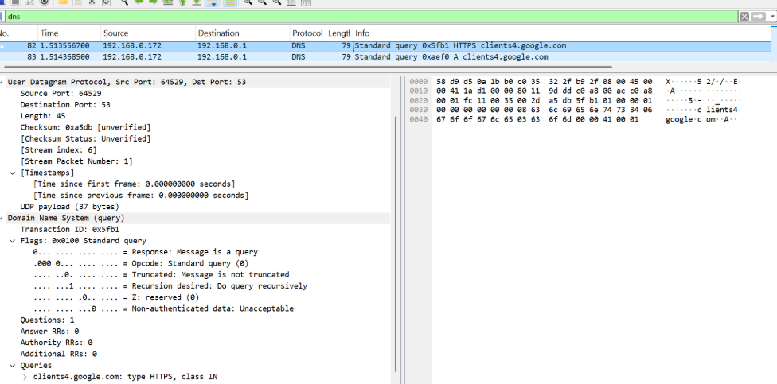
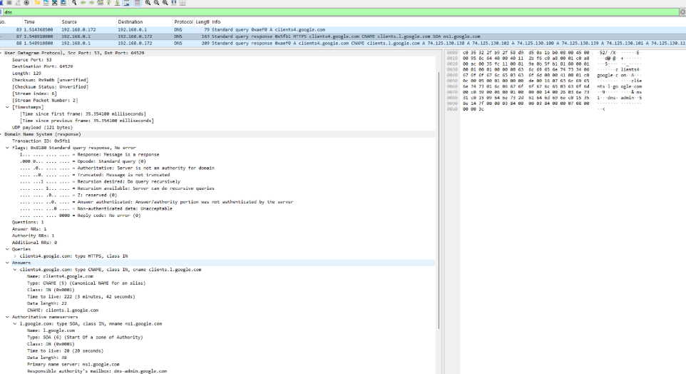

# Laporan Praktikum Jaringan Komputer - Modul 5
## ANALISIS TRANSPORT LAYER - USER DATAGRAM PROTOCOL (UDP)

---

### **Identitas Praktikan**
| Detail Mahasiswa | Informasi |
| :--- | :--- |
| **Nama** | [Fadia Nabila Shifa] |
| **NIM** | [103072400066] |
| **Kelas** | [IF-04-02] |

---

### **1. TUJUAN PRAKTIKUM**
* Memahami struktur header minimalis pada protokol UDP melalui analisis paket real-time.
* Menganalisis mekanisme *connectionless* pada proses transmisi data DNS.
* Menghitung efisiensi payload dan manajemen port (Well-known vs Ephemeral).
* Menginvestigasi pola komunikasi *Request-Response* melalui Transaction ID pada Wireshark.

---

### **2. DASAR TEORI**
**User Datagram Protocol (UDP)** merupakan protokol *Transport Layer* (Layer 4) yang bersifat **Connectionless** dan **Unreliable**. Berbeda dengan TCP, UDP tidak melakukan proses *handshake* untuk memulai koneksi, tidak menjamin urutan paket (*sequencing*), dan tidak melakukan transmisi ulang jika terjadi data hilang (*best-effort delivery*).

Karakteristik utama UDP adalah memiliki **overhead** yang sangat rendah karena struktur headernya hanya berukuran **8 byte**. Struktur header ini terdiri dari empat field utama: *Source Port*, *Destination Port*, *Length*, dan *Checksum*. Karena sifatnya yang cepat dan ringan, UDP sangat ideal digunakan untuk aplikasi yang mementingkan latensi rendah seperti DNS, VoIP, dan Online Gaming.

---

### **3. LANGKAH KERJA**
1. **Persiapan:** Membuka aplikasi Wireshark dan memilih interface jaringan yang aktif (Wi-Fi atau Ethernet).
2. **Pembersihan Cache:** Menjalankan perintah `ipconfig /flushdns` pada Command Prompt untuk memastikan resolusi nama dilakukan melalui jaringan, bukan memori lokal.
3. **Trigger Trafik:** Menjalankan perintah `nslookup google.com` untuk memicu pengiriman paket UDP.
4. **Sniffing & Filtering:** Menghentikan capture Wireshark dan menerapkan filter `dns` untuk mengisolasi paket UDP yang relevan.
5. **Analisis:** Membedah bagian *User Datagram Protocol* pada panel detail paket untuk mengamati isi header.

---

### **4. HASIL DAN ANALISIS PRAKTIKUM**

#### **4.1 Capture Trafik UDP (DNS Query & Response)**

**Analisis Teknis:**
Berdasarkan capture, teridentifikasi penggunaan **Protocol Number 17 (0x11)** pada IP Header yang mengarahkan data ke protokol UDP. Transaksi dimulai dengan *Standard Query* klien ke server DNS. Penggunaan UDP terbukti sangat efektif karena resolusi nama dilakukan secara instan tanpa perlu sinkronisasi koneksi awal, sehingga menghemat sumber daya jaringan.

#### **4.2 Detail Analisis Header dan Perhitungan Payload**
Berikut adalah rincian data teknis yang diperoleh dari panel detail paket Wireshark:

| Parameter | Hasil Pengamatan / Perhitungan | Analisis Fungsi |
| --- | --- | --- |
| **Source Port (Query)** | 64529 | Port dinamis (*ephemeral*) yang dibuka klien. |
| **Destination Port (Query)** | 53 | Port standar (*well-known*) untuk layanan DNS. |
| **UDP Header Size** | 8 Byte | Ukuran tetap (*fixed-length*) tanpa opsi tambahan. |
| **Payload Query** | 37 Byte ($45 - 8$) | Data aplikasi DNS yang dikirim klien. |
| **Payload Response** | 121 Byte ($129 - 8$) | Data jawaban DNS yang diterima dari server. |
| **Transaction ID** | 0x5fb1 | Pengenal unik untuk mencocokkan Query & Response. |

**Analisis Mendalam:**
* **Port Reversal:** Terjadi pembalikan port pada paket respon, di mana port 53 menjadi pengirim dan 64529 menjadi tujuan.
* **Transaction ID Matching:** Keberadaan ID `0x5fb1` yang identik membuktikan bahwa meskipun UDP tidak memiliki *sequence number*, layer aplikasi tetap dapat melakukan validasi jawaban atas permintaan yang dikirim sebelumnya.
* **Payload Expansion:** Paket respon lebih besar karena membawa *Resource Records* tambahan seperti alamat IP, CNAME, dan SOA (Start of Authority).

#### **4.3 Investigasi DNS Record & CNAME Chaining**
Analisis pada *DNS Response* menunjukkan bahwa `clients4.google.com` adalah alias (**CNAME**) yang merujuk pada `clients.l.google.com`. Mekanisme ini membuktikan implementasi **Load Balancing** dan manajemen distribusi konten secara dinamis oleh Google. Terdeteksi juga record **SOA** yang menunjukkan otoritas utama domain berada pada `ns1.google.com`.

#### **4.4 Ringkasan Teknis Karakteristik UDP**
Berdasarkan pengamatan menyeluruh, berikut adalah parameter teknis utama UDP:

| Parameter | Nilai | Keterangan |
| --- | --- | --- |
| **Jumlah Field Header** | 4 Field | Source Port, Dest Port, Length, Checksum. |
| **Maksimum Payload Teoritis** | 65.527 byte | Berdasarkan limitasi 16-bit field Length. |
| **Maksimum Payload Praktis** | ~1472 byte | Batas optimal agar tidak terjadi fragmentasi IP. |
| **Rentang Port Ephemeral** | 49152 - 65535 | Alokasi port sementara oleh Sistem Operasi. |
| **Pola Komunikasi** | Request-Response | Komunikasi dua arah tanpa status koneksi. |

---

### **5. KESIMPULAN**
Berdasarkan praktikum Modul 5, dapat disimpulkan bahwa:
1. **Header Efisien:** UDP hanya memiliki overhead sebesar 8 byte, menjadikannya protokol yang sangat ringan untuk transmisi data cepat.
2. **Identifikasi Sesi:** UDP bergantung pada Transaction ID di level aplikasi untuk membedakan antar transaksi karena sifatnya yang *connectionless*.
3. **Limitasi Payload:** Meskipun mampu membawa data besar, efisiensi maksimal dicapai jika data tetap berada di bawah nilai MTU (1500 byte) guna menghindari fragmentasi.
4. **Analisis Wireshark:** Penggunaan filter `dns` dan bedah paket secara visual sangat efektif dalam membuktikan teori manajemen port dan struktur enkapsulasi pada Transport Layer.