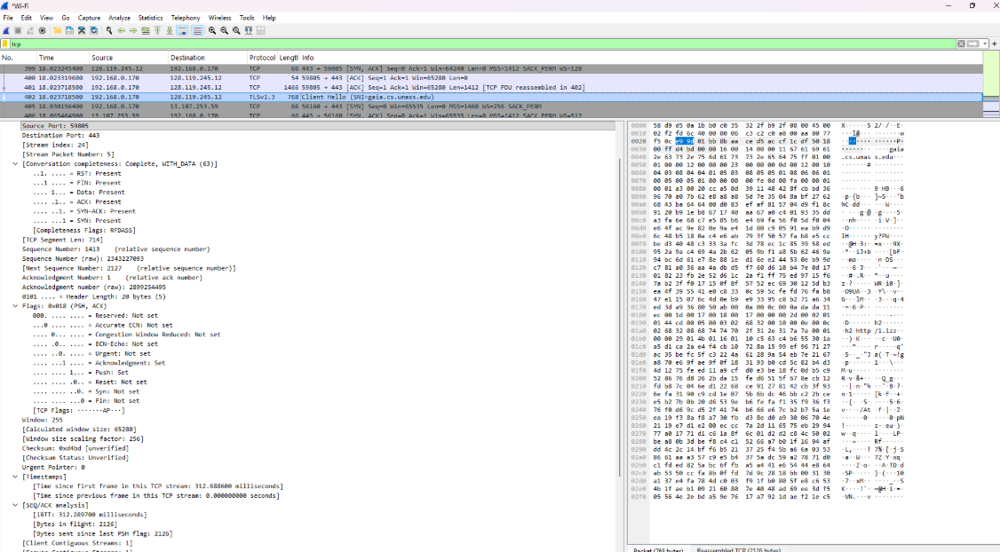
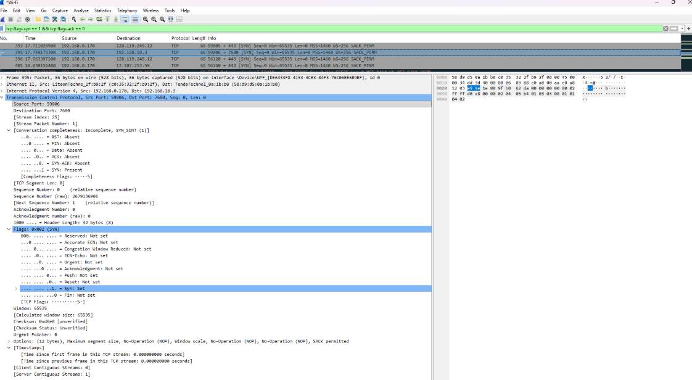
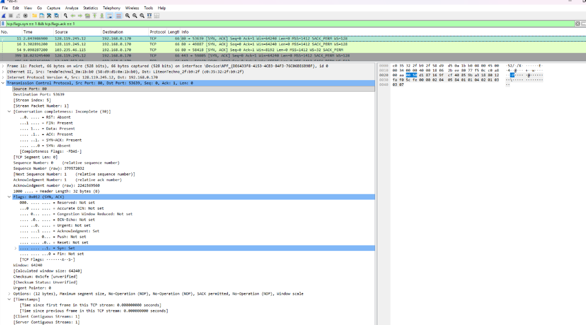
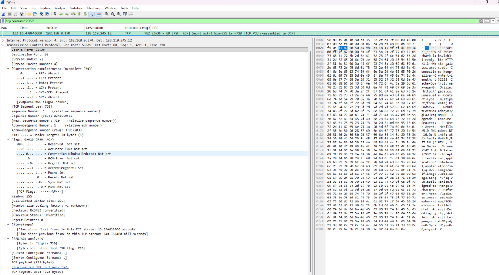
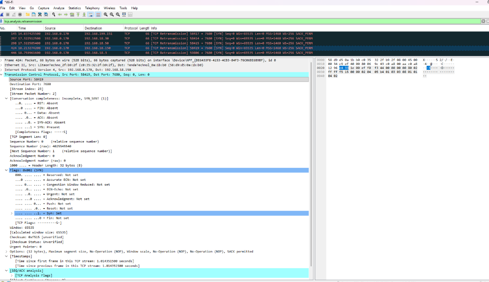
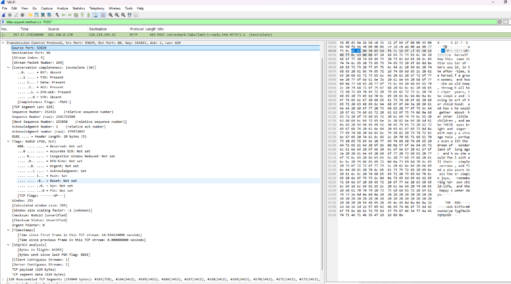
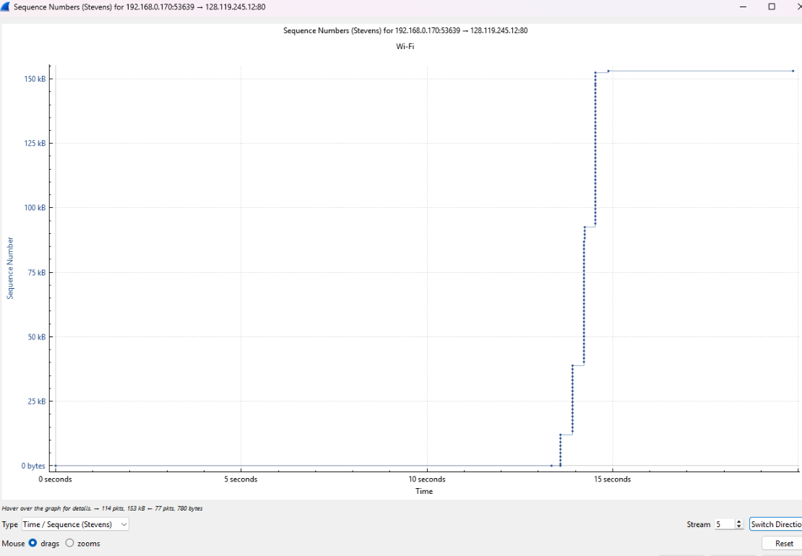

# Laporan Praktikum Jaringan Komputer - Modul 6
## MODUL 6: ANALISIS TRANSPORT LAYER - TRANSMISSION CONTROL PROTOCOL (TCP)

---

### **Identitas Praktikan**
| Detail Mahasiswa | Informasi |
| :--- | :--- |
| **Nama** | [Fadia Nabila Shifa] |
| **NIM** | [103072400066] |
| **Kelas** | [IF-04-02] |

---

### **1. TUJUAN PRAKTIKUM**
* Menganalisis cara kerja protokol TCP secara mendalam menggunakan tool Wireshark.
* Mengidentifikasi parameter penting TCP: Sequence Number, Acknowledgment, dan mekanisme reliabilitas.
* Mengamati perilaku Congestion Control (Fase Slow Start & Congestion Avoidance).
* Menghitung nilai Throughput koneksi dan estimasi Round Trip Time (RTT).

---

### **2. DASAR TEORI**
**Transmission Control Protocol (TCP)** adalah protokol inti pada Transport Layer (Layer 4) yang bersifat connection-oriented. TCP menjamin pengiriman data melalui mekanisme End-to-End yang ketat dengan beberapa pilar utama:

* **Three-Way Handshake:** Proses inisialisasi koneksi untuk menyelaraskan Sequence Number dan parameter kontrol (SYN, SYN-ACK, ACK).
* **Reliability & Error Recovery:** Memberikan nomor urut (Sequence Number) dan menerima konfirmasi (Acknowledgment). Jika paket hilang, TCP melakukan retransmisi otomatis.
* **Flow Control (Sliding Window):** Mekanisme menggunakan Window Size untuk mencegah pengirim membanjiri buffer penerima.
* **Congestion Control:** Strategi menghindari kemacetan jaringan melalui fase Slow Start (pertumbuhan eksponensial) dan Congestion Avoidance (pertumbuhan linear).
* **MSS (Maximum Segment Size):** Ukuran maksimum payload data dalam satu segmen TCP (standar Ethernet: 1460 bytes).

---

### **3. LANGKAH KERJA**
1. Download file alice.txt dari server laboratorium.
2. Buka halaman unggah file di gaia.cs.umass.edu.
3. Jalankan Wireshark capture dan upload file alice.txt.
4. Stop capture dan gunakan filter: tcp && ip.addr == 128.119.245.12.
5. Analisis handshake, segmen data, dan grafik time-sequence.

---

### **4. HASIL DAN ANALISIS PRAKTIKUM**

#### **4.1 Identitas Koneksi TCP**

Berdasarkan capture, parameter identitas koneksi adalah:
* **Client IP:** 192.168.0.170 (Port: 59805)
* **Server IP:** 128.119.245.12 (Port: 443 / HTTPS)

#### **4.2 Analisis Three-Way Handshake**
**a. Paket SYN (Client -> Server)**

| Field | Nilai |
| --- | --- |
| Sequence Number | 0 (relative) |
| Flags | SYN |
| MSS | 1460 bytes |
| Window Scale | x256 |

**b. Paket SYN-ACK (Server -> Client)**

| Field | Nilai |
| --- | --- |
| Sequence Number | 0 |
| Acknowledgment | 1 |
| Flags | SYN, ACK |

**c. Paket ACK (Client -> Server)**
* **Detail:** Sequence: 1, Acknowledgment: 1, Flags: ACK.
* **Status:** Koneksi **ESTABLISHED**, siap transfer data.

#### **4.3 HTTP POST Segment (Data Transfer)**

Detail segmen pengiriman data pada Frame 163:
| Field | Nilai |
| --- | --- |
| Frame Number | 163 |
| Source / Destination | 192.168.0.170:53639 -> 128.119.245.12:80 |
| Sequence Number | 1 |
| Payload Size | 728 bytes |
| Flags | PSH, ACK |
| Window Size | 255 bytes |

#### **4.4 Flow Control & Window Size Analysis**

* **Perhitungan Window Size:**
  65535 x 256 = **16.776.960 bytes**
* **Analisis:** Tidak ditemukan Zero-window condition, buffer server selalu tersedia untuk menerima data tanpa hambatan.

#### **4.5 Retransmisi & Pola Acknowledgment**

* **Retransmisi:** Ditemukan paket pada No. 145, 297, 298, 424, 446.
* **Pola ACK:**
    | Karakteristik | Observasi |
    | --- | --- |
    | ACK Type | Cumulative ACK |
    | Frequency | Delayed ACK (~1 ACK per 2 segmen) |
    | SACK | Enabled |

#### **4.6 Analisis Congestion Control (Stevens Graph)**

| Fase | Waktu (s) | Pola Grafik | Interpretasi |
| --- | --- | --- | --- |
| Idle | 0 - 14 | Horizontal | Belum ada pengiriman data. |
| Slow Start | 14 - 14.5 | Vertikal curam | cwnd membesar secara eksponensial. |
| Selesai | > 15 | Horizontal | Transfer data selesai komplit. |

#### **4.7 Perhitungan Throughput**
* **Throughput Aktual:**
  156.672 bytes / 1 s = **1,25 Mbps**
* **Throughput Teoritis Maksimum:**
  65.280 bytes / 0,276 s = **1,89 Mbps**
* **Efisiensi:** **64%**

#### **4.8 Ringkasan Hasil Praktikum**
| Parameter | Nilai |
| --- | --- |
| Protokol | TCP (connection-oriented) |
| Handshake | SYN -> SYN-ACK -> ACK |
| MSS Client/Server | 1460 B / 1412 B |
| Window Size | 65.280 bytes |
| RTT | ~276 ms |
| Retransmisi | 0 paket (No Packet Loss) |
| Throughput Aktual | ~1.25 Mbps |
| Congestion Control | Slow Start |

---

### **5. KESIMPULAN**
1. **Handshake Berhasil:** Proses sinkronisasi berjalan lancar dengan negosiasi MSS 1460 bytes.
2. **Reliabilitas:** TCP menjamin data urut melalui Sequence dan Acknowledgment.
3. **Flow & Congestion Control:** Teramati fase Slow Start yang agresif dan tidak ada kondisi Zero Window.
4. **Performa:** Throughput 1.25 Mbps menunjukkan efisiensi 64% pada jaringan yang stabil.