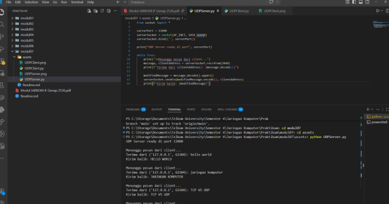
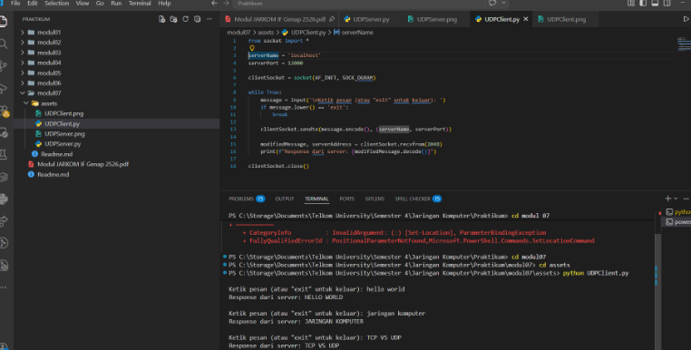

# Laporan Praktikum Jaringan Komputer - Modul 7
## Socket Programming : UDP dan TCP

---


### **Identitas Praktikan**
| Detail Mahasiswa | Informasi |
| :--- | :--- |
| **Nama** | [Fadia Nabila Shifa] |
| **NIM** | [103072400066] |
| **Kelas** | [IF-04-02] |


---

### **1. TUJUAN PRAKTIKUM**
* Memahami konsep dasar pemrograman socket pada Application Layer.
* Mengimplementasikan pengiriman data menggunakan protokol UDP (Connectionless).
* Mengimplementasikan komunikasi data berbasis koneksi menggunakan protokol TCP (Connection-Oriented).
* Menganalisis perbedaan mekanisme, keandalan, dan kecepatan antara protokol UDP dan TCP melalui Python.

---

### **2. DASAR TEORI**
**Socket Programming** adalah antarmuka (API) yang memungkinkan komunikasi antar proses dalam jaringan. Socket bertindak sebagai endpoint di Application Layer untuk mengirim dan menerima data melalui Transport Layer.

* **UDP (User Datagram Protocol):** Protokol *connectionless* (SOCK_DGRAM). Tidak memerlukan handshake, langsung mengirim paket (datagram). Cepat namun tidak menjamin paket sampai atau berurutan.
* **TCP (Transmission Control Protocol):** Protokol *connection-oriented* (SOCK_STREAM). Memerlukan proses *3-way handshake* (SYN, SYN-ACK, ACK) untuk menjamin data sampai secara utuh dan berurutan.

---

### **3. LANGKAH KERJA**
1. Mempersiapkan lingkungan Python pada VS Code.
2. Membuat file `UDPServer.py` dan `UDPClient.py`. Jalankan server terlebih dahulu, lalu kirim pesan teks dari client.
3. Membuat file `TCPServer.py` dan `TCPClient.py`. Amati proses inisiasi koneksi sebelum data ditransfer.
4. Melakukan pengujian *Multiple Clients* pada kedua protokol untuk melihat perbedaan penanganan antrian.
5. Mendokumentasikan hasil eksekusi terminal dan menganalisis perbedaan teknisnya.

---

### **4. HASIL DAN ANALISIS PRAKTIKUM**

#### **4.1 Praktikum UDP Socket**

**4.1.1 Kode Program UDP Server**

```python
from socket import *

serverPort = 12000
serverSocket = socket(AF_INET, SOCK_DGRAM)
serverSocket.bind(('', serverPort))

print("The server is ready to receive")

while True:
message, clientAddress = serverSocket.recvfrom(2048)
modifiedMessage = message.decode().upper()
serverSocket.sendto(modifiedMessage.encode(), clientAddress)
```

**Penjelasan Alur Program:**
* **Inisialisasi:** Server membuat socket dengan tipe `SOCK_DGRAM` (UDP) dan melakukan `bind` ke port 12000.
* **Proses:** Server masuk ke dalam *infinite loop* untuk menunggu paket. Karena UDP *connectionless*, server tidak perlu menerima koneksi, melainkan langsung membaca data dan alamat pengirim menggunakan `recvfrom()`.
* **Output:** Data diubah menjadi huruf kapital (uppercase) lalu dikirim balik ke alamat client yang spesifik menggunakan `sendto()`.

**4.1.2 Kode Program UDP Client**

```python
from socket import *

serverName = 'localhost'
serverPort = 12000

clientSocket = socket(AF_INET, SOCK_DGRAM)
message = input('Input lowercase sentence: ')
clientSocket.sendto(message.encode(), (serverName, serverPort))

modifiedMessage, serverAddress = clientSocket.recvfrom(2048)
print(modifiedMessage.decode())

clientSocket.close()
```

**Penjelasan Alur Program:**
* **Transmisi:** Client langsung mengirimkan data ke IP server dan port 12000 tanpa ada proses jabat tangan (*handshake*) terlebih dahulu.
* **Respon:** Setelah mengirim, client menunggu balasan paket dari server di port yang sama.
* **Penutup:** Setelah data diterima dan ditampilkan, socket langsung ditutup dengan `close()`.

**4.1.3 Hasil Eksekusi UDP**




**Analisis Hasil Eksekusi:**
1. **Server Ready:** Terminal server menampilkan pesan *"The server is ready to receive"*, menunjukkan socket telah berhasil di-bind ke port 12000.
2. **Input Client:** Saat client menginput teks lowercase (contoh: `hello world`), data langsung dikirim tanpa ada fase koneksi.
3. **Output:** Server menerima datagram, memprosesnya menjadi uppercase, dan client langsung menampilkan hasilnya. Hal ini menunjukkan komunikasi *one-way* yang sangat cepat karena tidak ada manajemen sesi.

---

#### **4.2 Praktikum TCP Socket**

**4.2.1 Kode Program TCP Server**


```python
from socket import *

serverPort = 12000
serverSocket = socket(AF_INET, SOCK_STREAM)
serverSocket.bind(('', serverPort))
serverSocket.listen(1)

print('The server is ready to receive')

while True:
connectionSocket, addr = serverSocket.accept()
sentence = connectionSocket.recv(1024).decode()
capitalizedSentence = sentence.upper()
connectionSocket.send(capitalizedSentence.encode())
connectionSocket.close()
```


**Penjelasan Alur Program:**
* **Setup:** Server menggunakan tipe `SOCK_STREAM` (TCP) dan memanggil `listen(1)` untuk mulai mendengarkan permintaan koneksi masuk.
* **Handshake:** Saat client mencoba terhubung, server menjalankan `accept()` yang secara otomatis melakukan *three-way handshake*.
* **Sesi:** Fungsi `accept()` menghasilkan socket baru (*connectionSocket*) yang khusus digunakan hanya untuk satu client tersebut, sehingga jalur komunikasi lebih terjamin (*reliable*).

**4.2.2 Kode Program TCP Client**


```python
from socket import *

serverName = 'localhost'
serverPort = 12000

clientSocket = socket(AF_INET, SOCK_STREAM)
clientSocket.connect((serverName, serverPort))

sentence = input('Input lowercase sentence: ')
clientSocket.send(sentence.encode())

modifiedSentence = clientSocket.recv(1024)
print('From Server:', modifiedSentence.decode())

clientSocket.close()
```

**Penjelasan Alur Program:**
* **Koneksi:** Client harus memanggil `connect()` terlebih dahulu. Jika server tidak aktif atau port salah, maka akan terjadi error karena koneksi tidak terbentuk.
* **Transfer:** Setelah status menjadi *Established*, client mengirim data menggunakan `send()` (tanpa perlu menyebutkan alamat lagi karena jalur sudah terbentuk).
* **Respon:** Client menerima balasan dari server melalui fungsi `recv()`.

**4.2.3 Hasil Eksekusi TCP**




**Analisis Hasil Eksekusi:**
1. **Connection Established:** Berbeda dengan UDP, saat client dijalankan, terjadi proses *handshake* terlebih dahulu. Jika server belum jalan, client akan langsung *error/refused*.
2. **Reliable Data:** Setelah koneksi stabil, data dikirim melalui jalur khusus (`connectionSocket`). Output yang diterima client (contoh: `NETWORKING LAB`) dipastikan sampai secara utuh karena adanya mekanisme kontrol pengiriman pada protokol TCP.
3. **Closing Connection:** Setelah pesan diterima, koneksi antara client dan server tersebut diputus secara formal menggunakan `close()`, sementara server utama tetap *listening* untuk client berikutnya.

---

### **5. PERBANDINGAN UDP VS TCP (HASIL PRAKTIKUM)**

**5.1 Perbedaan Implementasi**
| Aspek | UDP (User Datagram) | TCP (Transmission Control) |
| :--- | :--- | :--- |
| **Socket Type** | `SOCK_DGRAM` | `SOCK_STREAM` |
| **Koneksi** | Tidak perlu `connect()` | Perlu `connect()` |
| **Server Socket** | 1 socket untuk semua client | 2 socket (`server` & `connection`) |
| **Metode Kirim** | `sendto()` (Perlu info alamat) | `send()` (Langsung ke stream) |

**5.2 Perbedaan Hasil Eksekusi**
| Karakteristik | UDP | TCP |
| :--- | :--- | :--- |
| **Kecepatan** | Sangat tinggi (Low Latency) | Menengah (Handshake Delay) |
| **Reliability** | Rendah (Bisa paket hilang) | Tinggi (Jaminan pengiriman) |
| **Order** | Tidak menjamin urutan | Data sampai secara berurutan |

---

### **6. ANALISIS PRAKTIKUM**

**6.1 UDP Socket (Connectionless)**
* **Mekanisme Kerja:** Berdasarkan pengamatan, server UDP bersifat *stateless*, artinya server tidak memelihara status koneksi client. Data diterima sebagai unit independen (datagram) melalui fungsi `recvfrom()`.
* **Karakteristik Transmisi:** Tidak adanya fase jabat tangan (*handshake*) membuat UDP sangat efisien secara sumber daya, namun tidak memiliki mekanisme retransmisi. Jika terjadi interferensi jaringan, paket data bisa hilang tanpa ada pemberitahuan ke aplikasi.
* **Penggunaan Memori:** Server UDP lebih ringan karena hanya menggunakan satu socket untuk melayani banyak pengirim sekaligus.

**6.2 TCP Socket (Connection-Oriented)**
* **Mekanisme Kerja:** TCP memerlukan inisiasi koneksi melalui proses *Three-Way Handshake* (SYN, SYN-ACK, ACK). Hal ini terlihat dari keharusan memanggil fungsi `connect()` pada sisi client sebelum data bisa mengalir.
* **Keandalan Data:** Protokol ini menyediakan fitur *Flow Control* dan *Error Recovery*. Setiap paket memiliki nomor urut (*sequence number*), sehingga data yang diterima dipastikan utuh dan urut sesuai aslinya.
* **Manajemen Sesi:** Fungsi `accept()` di server menghasilkan *Dedicated Socket* khusus untuk tiap client. Hal ini memberikan jalur komunikasi yang aman dan terisolasi, namun membutuhkan manajemen memori yang lebih kompleks di sisi server.

---

### **7. TESTING TAMBAHAN**

**7.1 Multiple Clients (UDP)**
* **Skenario:** Mengirim data dari dua client berbeda ke satu port server secara simultan.
* **Hasil:** Server UDP mampu menangkap semua paket secara bergantian tanpa terjadi pemutusan koneksi atau antrian yang lama karena sifatnya yang tidak membutuhkan sesi tetap.

**7.2 Multiple Clients (TCP)**
* **Skenario:** Mencoba menghubungkan client kedua saat client pertama masih aktif mengirim data.
* **Hasil:** Terjadi fenomena *blocking*. Client kedua akan masuk ke status *waiting/pending* hingga client pertama melakukan `close()`. Ini terjadi karena kode bersifat *single-threaded* dan server harus menyelesaikan satu sesi koneksi penuh sebelum bisa melakukan `accept()` berikutnya.

---

### **8. KESIMPULAN**
1. **Protokol UDP** unggul dalam hal kecepatan dan efisiensi, menjadikannya pilihan ideal untuk aplikasi real-time seperti VoIP, Video Streaming, dan sistem game online.
2. **Protokol TCP** unggul dalam hal reliabilitas dan integritas data, sangat krusial untuk layanan yang tidak mentoleransi kesalahan data sedikitpun seperti HTTP (Web), FTP (Transfer File), dan SMTP (Email).
3. Pemilihan jenis socket (`SOCK_DGRAM` atau `SOCK_STREAM`) pada pemrograman Python harus disesuaikan dengan karakteristik aplikasi jaringan yang dibangun untuk menjaga performa dan keakuratan data.